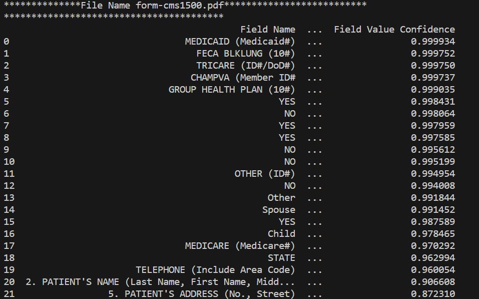
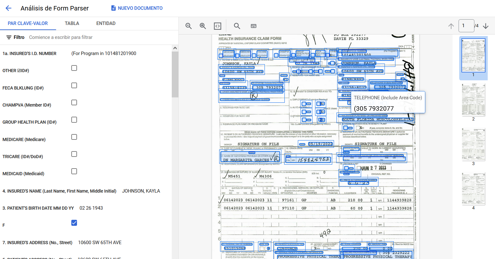

## Document AI (GCP) processing documents

**Description :**

The program (python source code ) call the ocr and form parser Document AI  (GCP).

The Document AI client API has interface in: 
  C#, Go, Node, Python, Java, Php, Ruby

Document AI has two main processor:
  * **OCR processor:**
  
    You can use Enterprise Document OCR as part of Document AI to detect and extract text and layout information from various documents. With configurable features, you can tailor the system to meet specific document-processing requirements.

    **Bibliografy:**

        * https://cloud.google.com/document-ai/docs/enterprise-document-ocr
        * https://cloud.google.com/document-ai/docs/process-documents-ocr

  * **Form Parser:** 

    Form Parser v2.0 is a document processing model that can extract items from any document type, such as fields and tables. Combine it with Document AI's optical character recognition (OCR) to augment and automate extraction.

    **Example of Form Parser output with program source code:**
      * 

  
    **Bibliografy:**

        * https://cloud.google.com/document-ai/docs/process-documents-form-parser
        * https://cloud.google.com/document-ai/docs/form-parser

  * **You can create or fine-tune other ocr document processor in Document AI if you have some examples for train and testing. There are a customize options in Document AI GCP platform**.

## Check tutorials: 
   * https://cloud.google.com/document-ai/docs/process-documents-client-libraries
   * https://cloud.google.com/document-ai/docs/process-documents-form-parser
   * https://cloud.google.com/document-ai/docs/process-documents-ocr

## Example Form Parser (Document AI) processor:
   * 
## Document AI (GCP) Billing
 * Free on charge 1 million pages
 * For each 1 million pages 1.5 dollars

## Learning resources: 
    * https://www.youtube.com/watch?v=6fylP4JMzjo
    * https://www.youtube.com/watch?v=F_jyoe1lQhg
    * https://medium.com/@rohit.gupta_47632/key-value-entity-extraction-from-forms-using-gcp-apis-9c59eb731dce
    * https://codelabs.developers.google.com/codelabs/docai-form-parser-v1-python#4

